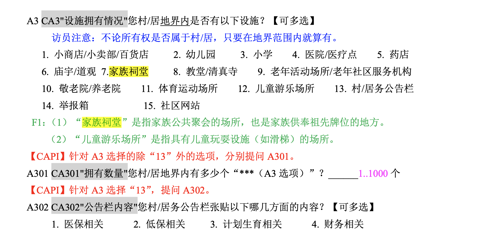

# 宗族文化 {#culture}

```{r setup, include=FALSE}
library(captioner)
knitr::opts_chunk$set(echo = TRUE,cache = T)
figureNums <- captioner(prefix = "图")
```

对于宗族文化的研究近些年一直是较为火热的研究热点[@Cao2022],[@Hanetsu2019a],[@ZhangShinYi2021a],[@ChenAkiraKai2018],[@ZhangKawagawa2017],[@ZHANG2020100]和[@FAN2023457]。但对于宗族文化的测度方法又各具差异，比如 @ZHANG2020100, @Cao2022 和 @FAN2023457 都是使用上海古籍出版社的县地方族谱数据来测量宗族文化，@ZhangKawagawa2017 使用的是CFPS的数据来测量；@ZhangShinYi2021a 使用的是地方的前三姓氏来作为度量，数据来源是2005年的1%人口抽样调查数据。数据质量上，直观感受是上海古籍出版社的数据会优于其他几个。

为啥宗族文化好，因为在文献中认为它是一个长期慢变量，最早可追溯到明朝，同时很难一时间突然冒出来说这地方突然有很强的宗族文化。所以这个能在做核心解释变量时候排除掉大部分的内生性的可能。同时宗族文化又可以用来解释一些制度和非制度之间的张力关系，内涵是比较丰富的。当然缺点就是很难说这个统计出来的家谱、姓氏占比、祠堂量就等同于宗族文化。


## 数据载入

如何在R中没有任何资源的前提下进行关于宗族文化的测度，我先试了做法最为简便的，城市的前三姓氏我翻遍了所有变量都没找到姓氏的变量；后面又看了下上海古籍出版社数据，数据量太大，估计需要爬虫等黑科技，遂又放弃，之后只有选择CFPS，之后也并不很顺利。

```{r}
library(haven)
```




### 数据清理步骤


- 第一，先将成人问卷中所需变量逐年清理，保留个人识别码 pid、家庭识别码 `fid`、以及清理后的变量；
- 第二，纵向合并 2010-2018 年清理后的成人问卷，得到个体层面面板数据；
- 第三，将家庭问卷中所需变量逐年清理，保留家户代码 `fid` 和清理后得到变量；
- 第四，纵向合并 2010-2018 年清理后的家庭问卷，得到家庭层面面板数据；
- 第五，根据年份 `year` 和家户识别码 `fid` 横向合并家庭层面面板数据和个体层面面板数据，得到研究所需的家户-个体层面 2010-2018 年面板数据。


```{r}
cfps2010comm <- read_dta("/Volumes/Expansion/micro-base-data/社区数据cfps/cfps2010comm_201906.dta")
df1 <- cfps2010comm%>%
  select(cid,provcd,countyid,cyear,cmonth,ca3_s_6,ca3_s_7)
head(df1)
dim(df1)
df1%>%str()
```

这里用`str()`来查看具体的变量和回答的信息。其中的变量分别表示村居样本代码、省国标码、区县顺序码、采访年份、访问月份、您村/居地界内设施：选择6、您村/居地界内设施：选择7，同时还可以进一步看到
数值与对应标签。其中的村居样本代码也是可以在家户调查中得到对应的。

```{r}
cfps2010comm$ca3_s_6[which(df1$ca3_s_6==-8)]=0
cfps2010comm$ca3_s_7[which(df1$ca3_s_7==-8)]=0
table(cfps2010comm$ca3_s_7)
table(cfps2010comm$ca3_s_6)
na.omit(df1)
dim(df1)
```


根据社区问卷手册，我们可以指导

```{r}
library(dplyr)
cfps2010comm%>%
  group_by(provcd)%>%
  dplyr::summarise(x1=sum(ca3_s_6),x2=sum(ca3_s_7))->df2
df2
```


## 可视化


```{r as,fig.show='hold',fig.align='center',fig.cap="祠堂与族谱"}
library(ggplot2)
ggplot(df2)+
  geom_point(aes(x=x1,y=x2))+
  geom_smooth(method = 'lm',aes(x=x1,y=x2))
```


## 地图

将论文图表绘制在图上。

```{r}
d <- attributes(df2$provcd)$labels
d <- as.data.frame(d)
d2 <- rownames(d)
d3 <- cbind(d,d2)
colnames(d3) <- c("provcd","label")
d4 <- merge(df2,d3,by = "provcd")
d4
```


json数据来源于[阿里 DataV 数据可视化平台](http://datav.aliyun.com/portal/school/atlas/area_selector)，能够在多个行政层级绘制中国地图。


```{r}
library(echarts4r.maps)
library(echarts4r)
colnames(d4) <- c("provcd","value1","value2","region")
china_map <- jsonlite::read_json("rep.json")
d4 %>%
  e_charts(region)%>%
  e_map_register("China2", china_map) %>%
  e_map(value1, map = "China2") %>%
  e_visual_map(value1)
```


```{r}
d4 %>%
  e_charts(region)%>%
  e_map_register("China2", china_map) %>%
  e_map(value2, map = "China2") %>%
  e_visual_map(value2)
```


上面的数据还是挺让人吃惊的，一般会认为宗族文化会在南方更为发达，包括修建祠堂上，我们通过图 \@ref(fig:as) 中知道祠堂与家谱是基本上在省层面是正相关的，但地域上呈现了较大的差异。可能是与抽样方法有关，需要进一步的处理。


## 其他数据源

目前学界用的较为广泛的是通过上海家族族谱来测算宗族文化，也就是看一个地方的族谱的密度来作为宗族文化的代理变量，代表性学者有浙大的[张川川](https://scholar.google.com/citations?user=_YWE1C4AAAAJ&hl=en&oi=ao)，他目前发表的关于宗族文化的论文有[@Cao2022], [@ZHANG2020100], [@ZhangKawagawa2017]。
很巧，他和合作者[Yiqin Xu](https://yiqingxu.org/)和博士生Jiarui Cao在JDE刊发的论文有[replicate file](https://yiqingxu.org/papers/english/2022_famine/replication.zip)，可直接下载。


但图中的图是使用ArcGIS来实现的，这里试图通过R来进行复刻。


```{r}
clan_gbook <- read_dta("/Users/a182501/stata-rep/rep-jde-2021-cao-xu-zhang/datafiles/gbooks_byyear.dta")
head(clan_gbook)
p <- clan_gbook%>%
  dplyr::filter(year<=2010&year>=1400)%>%
  ggplot()+
    geom_histogram(aes(year_imp),binwidth = 1)

p+geom_vline(aes(xintercept=1950), colour="#BB0000",size = 0.2)+
  geom_vline(aes(xintercept=1980), colour="#BB0000",size = 0.2)+xlab("Year")+ylab("Frequency")
```

在统计上的大小与原作者给出的频率有一定的差异，不过形状是相同的。


```{r clan-data}
library(mapchina)
library(sysfonts)
library(showtextdb)
library(showtext)
library(sf)
library(haven)
clan_disr <- read_dta("/Users/a182501/stata-rep/rep-jde-2021-cao-xu-zhang/datafiles/clan_distr.dta")
arrange(clan_disr,provcd)
```


```{r map-china}
head(china)
```


## 重新再利用

尽管我们没有关于县级层面的宏观经济等控制变量，但我们可以将获得的数据反向匹配给到个人，看宗族祠堂对于个人的影响是如何呈现的。

我们这里选择使用cfps2014年的数据，处理方法基本上与2010年一致。

```{r}
cfps2014comm <- read_dta("/Volumes/Expansion/micro-base-data/cfps/2014/cfps2014comm_201906.dta")
cfps2014comm$ca3_s_6[which(cfps2014comm$ca3_s_6==-8)] <- 0
cfps2014comm$ca3_s_7[which(cfps2014comm$ca3_s_7==-8)] <- 0
#View(cfps2014comm)随时观察变量
cfps2014comm%>%
  select(cid14,cid10,ca3_s_6,ca3_s_7)->comm14
head(comm14)
```


### 使用家户数据

```{r }
famconf14 <- read_dta("/Volumes/Expansion/micro-base-data/cfps/2014/cfps2014famconf_170630.dta")
head(famconf14)
```


### 数据合并

使用左连接`left_join`以保留我们的家户信息，用村居样本代码`cid14`来进行匹配。

```{r}
library(visdat)
famcon14_clan <- left_join(famconf14,comm14,by="cid14")
dim(famcon14_clan)
dim(famconf14)
```


### 数据清洗


```{r}
#View(famcon14_clan)
famcon14_clan%>%
  select(cid14,cid10,ca3_s_6,ca3_s_7,tb2_a_p,tb1y_a_p,cfps2014_interv_p,tb4_a14_p,urban14,tb4_a14_f)%>%
  dplyr::filter(urban14==0)%>%  # 找出是农村的
  dplyr::filter(tb4_a14_p!=-8|-9|-10|-2|-1)%>% # 剔除不适用的
  dplyr::filter(!is.na(cid10))%>%
  mutate(age=2014-tb1y_a_p)%>%
  mutate(eduyear = case_when(
    tb4_a14_p==8 ~ 23,
    tb4_a14_p==7 ~ 19,
    tb4_a14_p==6 ~ 16,
    tb4_a14_p==5 ~ 15,
    tb4_a14_p==4 ~ 12,
    tb4_a14_p==3 ~ 9,
    tb4_a14_p==2 ~ 6,
    tb4_a14_p==1 ~ 0
  ))%>%
  mutate(temple_dummy = case_when(
    ca3_s_6==0~0,
    ca3_s_6>0~1
  ))%>%
  mutate(genealogy_dummy = case_when(
    ca3_s_7 == 0~0,
    ca3_s_7 > 0~1
  ))%>%
  mutate(eduyear_fa = case_when(
    tb4_a14_f==8 ~ 23,
    tb4_a14_f==7 ~ 19,
    tb4_a14_f==6 ~ 16,
    tb4_a14_f==5 ~ 15,
    tb4_a14_f==4 ~ 12,
    tb4_a14_f==3 ~ 9,
    tb4_a14_f==2 ~ 6,
    tb4_a14_f==1 ~ 0
  )) -> facon14_clan_clean
```


```{r}
dim(facon14_clan_clean) # 查看数据维度 
sum(table(facon14_clan_clean$eduyear)) #受教育年限
table(facon14_clan_clean$eduyear_fa) # 父亲的受教育年限
table(facon14_clan_clean$temple_dummy) # 是否有祠堂
```

### 回归`eduyear~temple_dummy`

这里试图研究受教育年限是否会受到祠堂存在与否（宗族文化）的影响。控制年龄和父亲的受教育年限。

```{r}
colnames(facon14_clan_clean)
reg_temple_fa <- lm(data = facon14_clan_clean,eduyear~temple_dummy+age+eduyear_fa)# 控制父亲的受教育水平
summary(reg_temple_fa)
```

回归的结果显示系数为负相关，同时并不显著。


```{r}
reg_genealogy <- lm(data = facon14_clan_clean,eduyear~genealogy_dummy+age+eduyear_fa)
summary(reg_genealogy)
```


还是对族谱的回归也并不显著，不过都是负的系数，和一些学者之前研究的结论有一些差别，但可能是在这里控制变量控制的不够，可能存在内生性问题，比如遗漏一些关键的控制变量，受访者的智力水平、家庭规模，父亲的政治背景、教育理念、文化资本等。


不过个人认为这里可以使用族谱的数量，并不需要将其转变为虚拟变量。


```{r}
str(facon14_clan_clean$ca3_s_7)
facon14_clan_clean%>%
  dplyr::filter(ca3_s_7>=0)%>%
  lm(formula=eduyear~ca3_s_7+age+eduyear_fa)%>%
  summary()
```

虽然最终的结果差别并没有太多。


