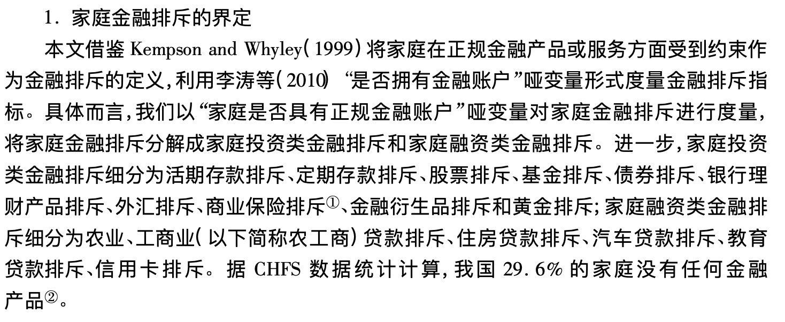

```{r setup, include=FALSE}
knitr::opts_chunk$set(echo = TRUE,cache = TRUE)
```

# CHFS

[CHFS](https://chfs.swufe.edu.cn/)是西南财经大学组织的中国家庭金融调查。中国家
庭金融调查采用三阶段、分层、与人口规模成比例(PPS)的抽样方法，通过科学抽样、现
代调查技术和调查管理手段，收集中国家庭金融微观信息，为国内外研究者提供研究
中国家庭金融问题的高质量微观数据。
CHFS样本覆盖全国29个省，262个县，总共包含28000多户家庭的资产负债、收入与支出、保险与保障，家庭人口特征及就业等方面详细信息的大型微观数据。


## 数据读取


```{r}
library(purrr)
get_var_label <- function(dta) {
  labels <- map(dta, function(x) attr(x, "label"))
  tibble(
    name = names(labels),
    label = as.character(labels)
  )
}
```


## 构建变量

### 社会互动

- Du et al. (2014)

- 社会互动相关的礼金支出、外出就餐支出、娱乐支出、通讯支出、交通支出、旅游
探亲支出、兄弟姐妹数量、与父母通话次数 8 个变量。


### 金融知识

在CHFS中第五部分就是关于金融知识、底层治理与主观评价。


```{r}
chfs_hh2013 <- read_dta("data/chfs/CHFS_2013/chfs2013_hh_20191120_version14.dta")
chfs_hh2013%>%get_var_label()
```


```{r}
dim(chfs_hh2013)
chfs_hh2013%>%
  select(starts_with("a400"))->df2_a
df2_na <- na.omit(df2_a) 
dim(df2_na)
df2_na%>%
  get_var_label()
```


参考 @ZhangGoDong2016 的做法：


```{r}
df2_na%>%
  mutate(fa1=case_when(
    a4002a%in%c(1,2,3)~1,
    a4002a%in%c(4,5)~0
  ))%>%
  mutate(fa2 = case_when(
    a4002b==1~1,
    a4002b==2~0
  ))%>%
   mutate(fa3 = case_when(
    a4007aa==1~1,
    a4007aa!=1~0
  ))%>%
  mutate(fa4=case_when(
    a4004a==2~1,
    a4004a!=2~0
  ))%>%
  mutate(fa5=case_when(
    a4006a==2~1,
    a4006a==1~0
  ))%>%
   mutate(fa6=case_when(
    a4005a==1~1,
    a4005a!=1~0
  ))%>%
  select(starts_with("fa"))->df_fa
```


```{r}
library(visdat)
df_fa %>%
  vis_dat()
```


```{r}
mean_fa <- map_dbl(df_fa,mean)
mean_fa
```

得到的均值水平会比原文章都普遍较高一些。但因素5的偏差较大。（但本人又认为这个变量不太好，更像是一个风险测试的问题，与受访者的风险偏好有关，并没有一个所谓正确的答案）

```{r}
1-mean_fa[5]
```


#### 因子转换

```{r}
library(psych) #KMO和Bartlette检验所需包
KMO(df_fa)
```
都大于0.6，勉强适合。

```{r}
bartlett.test(df_fa)
```
p值非常小，也验证可以做因子。


```{r}
corr=cor(df_fa)
eig=eigen(corr)
(ccx=(eig$va)/sum(eig$va))  #贡献率
(cx=cumsum(eig$va)/sum(eig$va)) #累计方差贡献率
```


```{r}

fit <- factanal(df_fa, 3, rotation="promax") # 第2个参数是提取的因子个数
print(fit, digits=2, sort=TRUE) # 输出结果
```


### 金融排斥

“是否有金融账户”来作为是否是存在金融排斥的代理变量。


```{r}
chfs_hh2013 %>%
  select(d1101)%>%
  dplyr::filter(!is.na(d1101))%>%
  mutate(cur= case_when(
    d1101 == 1~1,
    d1101 == 2~0
  ))->df3
mean(df3$cur)
```


也就是有人民币活期存款账户的有59.51%。但根据文章中的定义：还需要对其余的金融账户进行筛选，通过逻辑运算实现。




