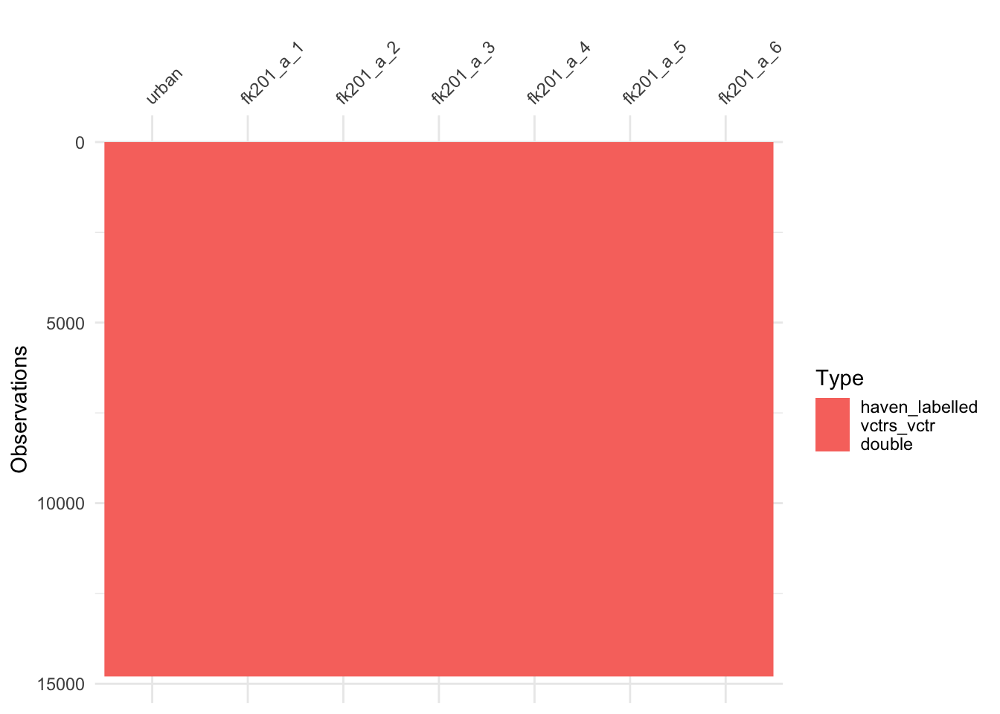

# 土地流转研究

数据来源：[CFPS](http://www.isss.pku.edu.cn/cfps/index.htm)

本章主要参考四川师范大学王敏杰老师的[研究笔记](https://bookdown.org/wangminjie/R4cfps/land.html)

## 载入包


```r
library(tidyverse)
library(purrr)
library(haven)
library(visdat)
```


## 导入数据


```r
cfps2010family <- read_dta("/Volumes/Expansion/micro-base-data/cfps/2010/cfps2010famecon_202008.dta")
cfps2010family %>%
  select(fid,urban, starts_with("fk201_a")) %>%
  glimpse()
```

```
## Rows: 14,797
## Columns: 8
## $ fid       <dbl+lbl> 110001, 110003, 110005, 110006, 110007, 110009, 110010, …
## $ urban     <dbl+lbl> 1, 1, 1, 1, 1, 1, 1, 1, 1, 1, 1, 1, 1, 1, 1, 1, 1, 1, 1,…
## $ fk201_a_1 <dbl+lbl> -8, -8, -8, -8, -8, -8, -8, -8, -8, -8, -8, -8, -8, -8, …
## $ fk201_a_2 <dbl+lbl> -8.0, -8.0, -8.0, -8.0,  2.5, -8.0, -8.0, -8.0, -8.0, -8…
## $ fk201_a_3 <dbl+lbl> -8, -8, -8, -8, -8, -8, -8, -8, -8, -8, -8, -8, -8, -8, …
## $ fk201_a_4 <dbl+lbl> -8, -8, -8, -8, -8, -8, -8, -8, -8, -8, -8, -8, -8, -8, …
## $ fk201_a_5 <dbl+lbl> -8, -8, -8, -8, -8, -8, -8, -8, -8, -8, -8, -8, -8, -8, …
## $ fk201_a_6 <dbl+lbl> -8, -8, -8, -8, -8, -8, -8, -8, -8, -8, -8, -8, -8, -8, …
```


## 查看变量标签


对于原有数据，都是存在一个标签来显示原始的问题形式，因此我们可以先查看我们想要找的问题的标签是否对应。先创建一个`get_var_label`的函数。


```r
library(purrr)
get_var_label <- function(dta) {
  labels <- map(dta, function(x) attr(x, "label"))
  data_frame(
    name = names(labels),
    label = as.character(labels)
  )
}
```


根据观察原有标签，我们可知道`fk201_a_n`的变量都是拥有的农业资产，`fk202_a_n`、`fk203_a_n`和`fk204_a_n`分别是经营、转租入和转租出多少农业资产。


```r
cfps2010family %>%
  select(urban, starts_with("fk201_a")) %>%
  get_var_label() %>%
  head()
```

```
## Warning: `data_frame()` was deprecated in tibble 1.1.0.
## ℹ Please use `tibble()` instead.
## This warning is displayed once every 8 hours.
## Call `lifecycle::last_lifecycle_warnings()` to see where this warning was
## generated.
```

```
## # A tibble: 6 × 2
##   name      label                           
##   <chr>     <chr>                           
## 1 urban     基于国家统计局资料的城乡分类变量
## 2 fk201_a_1 您家拥有多少亩水田              
## 3 fk201_a_2 您家拥有多少亩旱地              
## 4 fk201_a_3 您家拥有多少亩林地              
## 5 fk201_a_4 您家拥有多少亩果园              
## 6 fk201_a_5 您家拥有多少亩草场
```


```r
ur_and_land <- cfps2010family %>%
  select(urban, starts_with("fk201_a")) %>%
  map(~ count(data.frame(x = .x), x))
ur_and_land$urban
```

```
##   x    n
## 1 0 7694
## 2 1 7103
```

这里使用了`map`函数来构建一个映射，映射到一个累加求和，第一张表是农业户口和城镇户口的数量对比，后面的表都是密度分布。


## 数据规整


```r
library(naniar)
cfps2010family %>%
  select(urban, starts_with("fk201_a")) %>%
  miss_var_summary()
```

```
## # A tibble: 7 × 3
##   variable  n_miss pct_miss
##   <chr>      <int>    <dbl>
## 1 urban          0        0
## 2 fk201_a_1      0        0
## 3 fk201_a_2      0        0
## 4 fk201_a_3      0        0
## 5 fk201_a_4      0        0
## 6 fk201_a_5      0        0
## 7 fk201_a_6      0        0
```

基本上是没有缺失数据。


```r
library(visdat)
cfps2010family %>%
  select(urban, starts_with("fk201_a")) %>%
  vis_dat()
```




为防止包之间的函数冲突，使用`conflicted`来prefer到`dplyr`中的`filter`。


```r
library(conflicted)
conflict_prefer("filter", "dplyr")

cfps2010family %>%
  select(urban, starts_with("fk2_s"))%>%
  filter(urban == 0)
```

```
## # A tibble: 7,694 × 6
##    urban     fk2_s_1     fk2_s_2     fk2_s_3     fk2_s_4     fk2_s_5    
##    <dbl+lbl> <dbl+lbl>   <dbl+lbl>   <dbl+lbl>   <dbl+lbl>   <dbl+lbl>  
##  1 0 [乡村]   4 [果园]   -8 [不适用] -8 [不适用] -8 [不适用] -8 [不适用]
##  2 0 [乡村]   2 [旱地]   -8 [不适用] -8 [不适用] -8 [不适用] -8 [不适用]
##  3 0 [乡村]   4 [果园]   -8 [不适用] -8 [不适用] -8 [不适用] -8 [不适用]
##  4 0 [乡村]   4 [果园]   -8 [不适用] -8 [不适用] -8 [不适用] -8 [不适用]
##  5 0 [乡村]  -8 [不适用] -8 [不适用] -8 [不适用] -8 [不适用] -8 [不适用]
##  6 0 [乡村]  -8 [不适用] -8 [不适用] -8 [不适用] -8 [不适用] -8 [不适用]
##  7 0 [乡村]  -8 [不适用] -8 [不适用] -8 [不适用] -8 [不适用] -8 [不适用]
##  8 0 [乡村]   6 [池塘]   -8 [不适用] -8 [不适用] -8 [不适用] -8 [不适用]
##  9 0 [乡村]   4 [果园]   -8 [不适用] -8 [不适用] -8 [不适用] -8 [不适用]
## 10 0 [乡村]  -8 [不适用] -8 [不适用] -8 [不适用] -8 [不适用] -8 [不适用]
## # ℹ 7,684 more rows
```


先找出有经营土地的家户：并不考虑是否是自己拥有还是转租入。


```r
a <- cfps2010family %>%
  select(fid,urban, starts_with("fk201_a")) %>%
  filter_at(vars(starts_with("fk201_a")), any_vars(. > 0))
a
```

```
## # A tibble: 7,688 × 8
##    fid       urban   fk201_a_1 fk201_a_2 fk201_a_3 fk201_a_4 fk201_a_5 fk201_a_6
##    <dbl+lbl> <dbl+l> <dbl+lbl> <dbl+lbl> <dbl+lbl> <dbl+lbl> <dbl+lbl> <dbl+lbl>
##  1 110007    1 [城… -8 [不适…  2.5    … -8 [不适… -8 [不适… -8 [不适… -8 [不适…
##  2 120033    1 [城… -8 [不适… -8 [不适… -8 [不适…  0.900  … -8 [不适… -8 [不适…
##  3 120073    0 [乡… -8 [不适… -8 [不适… -8 [不适…  5.10   … -8 [不适… -8 [不适…
##  4 120074    0 [乡… -8 [不适…  1.80   … -8 [不适… -8 [不适… -8 [不适… -8 [不适…
##  5 120076    0 [乡… -8 [不适… -8 [不适… -8 [不适…  6      … -8 [不适… -8 [不适…
##  6 120080    0 [乡… -8 [不适… -8 [不适… -8 [不适… -8 [不适… -8 [不适… 38      …
##  7 120081    0 [乡… -8 [不适… -8 [不适… -8 [不适…  4      … -8 [不适… -8 [不适…
##  8 120084    0 [乡… -8 [不适… -8 [不适… -8 [不适…  1.5    … -8 [不适… -8 [不适…
##  9 120087    0 [乡… -8 [不适… -8 [不适… -8 [不适…  3      … -8 [不适… -8 [不适…
## 10 120088    0 [乡… -8 [不适…  1.5    … -8 [不适… -8 [不适… -8 [不适… -8 [不适…
## # ℹ 7,678 more rows
```


再将负值转变为0。


```r
a %>% mutate_at(vars(starts_with("fk201_a")), funs(replace(., . < 0, 0)))
```

```
## Warning: `funs()` was deprecated in dplyr 0.8.0.
## ℹ Please use a list of either functions or lambdas:
## 
## # Simple named list: list(mean = mean, median = median)
## 
## # Auto named with `tibble::lst()`: tibble::lst(mean, median)
## 
## # Using lambdas list(~ mean(., trim = .2), ~ median(., na.rm = TRUE))
## Call `lifecycle::last_lifecycle_warnings()` to see where this warning was
## generated.
```

```
## # A tibble: 7,688 × 8
##    fid       urban   fk201_a_1 fk201_a_2 fk201_a_3 fk201_a_4 fk201_a_5 fk201_a_6
##    <dbl+lbl> <dbl+l> <dbl+lbl> <dbl+lbl> <dbl+lbl> <dbl+lbl> <dbl+lbl> <dbl+lbl>
##  1 110007    1 [城… 0         2.5       0         0         0          0       
##  2 120033    1 [城… 0         0         0         0.900     0          0       
##  3 120073    0 [乡… 0         0         0         5.10      0          0       
##  4 120074    0 [乡… 0         1.80      0         0         0          0       
##  5 120076    0 [乡… 0         0         0         6         0          0       
##  6 120080    0 [乡… 0         0         0         0         0         38       
##  7 120081    0 [乡… 0         0         0         4         0          0       
##  8 120084    0 [乡… 0         0         0         1.5       0          0       
##  9 120087    0 [乡… 0         0         0         3         0          0       
## 10 120088    0 [乡… 0         1.5       0         0         0          0       
## # ℹ 7,678 more rows
```


### 农业生产效率


```r
a <- cfps2010family %>%
  select(fid,urban, starts_with("fk201_a"),fk3,fk4,fe1)%>%
  mutate(revenue = fk3-fk4)%>%
  mutate_at(vars(starts_with("fk201_a")), funs(replace(., . < 0, 0)))%>%
  mutate_at(vars("revenue"), funs(replace(., . < 0, 0)))%>%
  dplyr::filter(revenue>0)
```

```
## Warning: `funs()` was deprecated in dplyr 0.8.0.
## ℹ Please use a list of either functions or lambdas:
## 
## # Simple named list: list(mean = mean, median = median)
## 
## # Auto named with `tibble::lst()`: tibble::lst(mean, median)
## 
## # Using lambdas list(~ mean(., trim = .2), ~ median(., na.rm = TRUE))
## Call `lifecycle::last_lifecycle_warnings()` to see where this warning was
## generated.
```

```
## Warning: `funs()` was deprecated in dplyr 0.8.0.
## ℹ Please use a list of either functions or lambdas:
## 
## # Simple named list: list(mean = mean, median = median)
## 
## # Auto named with `tibble::lst()`: tibble::lst(mean, median)
## 
## # Using lambdas list(~ mean(., trim = .2), ~ median(., na.rm = TRUE))
## Call `lifecycle::last_lifecycle_warnings()` to see where this warning was
## generated.
```

```r
a
```

```
## # A tibble: 6,093 × 12
##    fid       urban   fk201_a_1 fk201_a_2 fk201_a_3 fk201_a_4 fk201_a_5 fk201_a_6
##    <dbl+lbl> <dbl+l> <dbl+lbl> <dbl+lbl> <dbl+lbl> <dbl+lbl> <dbl+lbl> <dbl+lbl>
##  1 110007    1 [城… 0         2.5       0         0         0         0        
##  2 120033    1 [城… 0         0         0         0.900     0         0        
##  3 120074    0 [乡… 0         1.80      0         0         0         0        
##  4 120075    0 [乡… 0         0         0         0         0         0        
##  5 120076    0 [乡… 0         0         0         6         0         0        
##  6 120081    0 [乡… 0         0         0         4         0         0        
##  7 120084    0 [乡… 0         0         0         1.5       0         0        
##  8 120087    0 [乡… 0         0         0         3         0         0        
##  9 120088    0 [乡… 0         1.5       0         0         0         0        
## 10 120090    0 [乡… 0         0         0         4.5       0         0        
## # ℹ 6,083 more rows
## # ℹ 4 more variables: fk3 <dbl+lbl>, fk4 <dbl+lbl>, fe1 <dbl+lbl>,
## #   revenue <dbl>
```


一个有效的建议是在对原始数据进行操作时候，尽量保证原始数据的不变，再通过`%>%`进行传导到新的数据框中。


我们计算农业生产效率的方法有很多这里主要参考的是一些主流的做法：将单位面积纯利润作为效率的衡量指标


```r
a%>%
  mutate(landsum = rowSums(.[2:7]))%>%
  filter(landsum>0)%>%
  mutate(rates = revenue/landsum)->a1
a1
```

```
## # A tibble: 6,048 × 14
##    fid       urban   fk201_a_1 fk201_a_2 fk201_a_3 fk201_a_4 fk201_a_5 fk201_a_6
##    <dbl+lbl> <dbl+l> <dbl+lbl> <dbl+lbl> <dbl+lbl> <dbl+lbl> <dbl+lbl> <dbl+lbl>
##  1 110007    1 [城… 0         2.5       0         0         0         0        
##  2 120033    1 [城… 0         0         0         0.900     0         0        
##  3 120074    0 [乡… 0         1.80      0         0         0         0        
##  4 120076    0 [乡… 0         0         0         6         0         0        
##  5 120081    0 [乡… 0         0         0         4         0         0        
##  6 120084    0 [乡… 0         0         0         1.5       0         0        
##  7 120087    0 [乡… 0         0         0         3         0         0        
##  8 120088    0 [乡… 0         1.5       0         0         0         0        
##  9 120090    0 [乡… 0         0         0         4.5       0         0        
## 10 120091    0 [乡… 0         0         0         4         0         0        
## # ℹ 6,038 more rows
## # ℹ 6 more variables: fk3 <dbl+lbl>, fk4 <dbl+lbl>, fe1 <dbl+lbl>,
## #   revenue <dbl>, landsum <dbl>, rates <dbl>
```


### 流动人口

我们可以用外出打工在家庭人口中的占比来测算流动率。


```r
library(conflicted)
conflict_prefer('filter',"dplyr")
a1%>%
  filter(fe1!=5)->a2
a2$fe1[a2$fe1==3] <- 0
a2%>%
  select(rates,fe1)
```

```
## # A tibble: 6,017 × 2
##    rates fe1      
##    <dbl> <dbl+lbl>
##  1  371. 0        
##  2 7632. 0        
##  3  667. 0        
##  4 3000  1 [有]   
##  5 6500  0        
##  6 2000  0        
##  7 6667. 0        
##  8 3333. 0        
##  9 4444. 0        
## 10 6250  0        
## # ℹ 6,007 more rows
```


## 模型建立

我们试图考察关于流动人口与农业生产效率之间的关系：


```r
reg <- lm(data = a2,fe1~rates)
summary(reg)
```

```
## 
## Call:
## lm(formula = fe1 ~ rates, data = a2)
## 
## Residuals:
##     Min      1Q  Median      3Q     Max 
## -0.3873 -0.3869 -0.3862  0.6130  0.9042 
## 
## Coefficients:
##               Estimate Std. Error t value Pr(>|t|)    
## (Intercept)  3.873e-01  6.329e-03    61.2   <2e-16 ***
## rates       -8.330e-07  6.409e-07    -1.3    0.194    
## ---
## Signif. codes:  0 '***' 0.001 '**' 0.01 '*' 0.05 '.' 0.1 ' ' 1
## 
## Residual standard error: 0.4869 on 6015 degrees of freedom
## Multiple R-squared:  0.0002807,	Adjusted R-squared:  0.0001145 
## F-statistic: 1.689 on 1 and 6015 DF,  p-value: 0.1938
```

不过不显著。。。不过系数上看是一个较为合理的存在（效率上升，抑制外出）。对于一个想要看星星的reg monkey来说极其苦恼。我们可以考虑换一个变量：一篇2016年在《中国农村经济》的文章研究“非农就业、土地流转与农业生产效率变化”利用的是非农就业来考察劳动生产率（同样也是用单位土地的农产品收入来测算）就较为显著，主要的差别在于非农就业数量来测度，并非一个虚拟变量。
还有一个可能是在先前的数据处理中存在一定的问题，比如是否将未从事农业活动的家户过滤进来。


```r
cfps2010family%>%
  select(fid,familysize,starts_with("fu1_s"))%>%
  mutate_at(vars(starts_with("fu1_s")), funs(replace(., . < 0, 0)))%>%
  mutate_at(vars(starts_with("fu1_s")), funs(replace(., . >=1, 1)))->b1
```

```
## Warning: `funs()` was deprecated in dplyr 0.8.0.
## ℹ Please use a list of either functions or lambdas:
## 
## # Simple named list: list(mean = mean, median = median)
## 
## # Auto named with `tibble::lst()`: tibble::lst(mean, median)
## 
## # Using lambdas list(~ mean(., trim = .2), ~ median(., na.rm = TRUE))
## Call `lifecycle::last_lifecycle_warnings()` to see where this warning was
## generated.
```

```
## Warning: `funs()` was deprecated in dplyr 0.8.0.
## ℹ Please use a list of either functions or lambdas:
## 
## # Simple named list: list(mean = mean, median = median)
## 
## # Auto named with `tibble::lst()`: tibble::lst(mean, median)
## 
## # Using lambdas list(~ mean(., trim = .2), ~ median(., na.rm = TRUE))
## Call `lifecycle::last_lifecycle_warnings()` to see where this warning was
## generated.
```


并不建议一次性将所有变换都做完，之后再检查是非常痛苦的。。。


```r
b1%>%
  mutate(mig = rowSums(.[3:14]))%>%
  select(fid,familysize,mig)%>%
  mutate(mig_rate = mig/familysize)%>%
  filter(mig_rate<=1&mig_rate>=0)->b2# 剔除异常值
barplot(table(b2$mig_rate))
```


```r
dim(b2)
```

```
## [1] 14795     4
```


```r
b3 <- merge(a2,b2,by="fid")
reg2 <- lm(data = b3,mig_rate~rates)
summary(reg2)
```

```
## 
## Call:
## lm(formula = mig_rate ~ rates, data = b3)
## 
## Residuals:
##     Min      1Q  Median      3Q     Max 
## -0.1249 -0.1248 -0.1247  0.1251  0.8760 
## 
## Coefficients:
##               Estimate Std. Error t value Pr(>|t|)    
## (Intercept)  1.249e-01  2.384e-03   52.40   <2e-16 ***
## rates       -2.029e-07  2.415e-07   -0.84    0.401    
## ---
## Signif. codes:  0 '***' 0.001 '**' 0.01 '*' 0.05 '.' 0.1 ' ' 1
## 
## Residual standard error: 0.1834 on 6015 degrees of freedom
## Multiple R-squared:  0.0001174,	Adjusted R-squared:  -4.887e-05 
## F-statistic: 0.706 on 1 and 6015 DF,  p-value: 0.4008
```

p值比之前还更大了。。。上述提到的文章的核心解释变量是非农占家庭劳动力比例，但目前还不知咋构建的。。。想到了再补上去。


